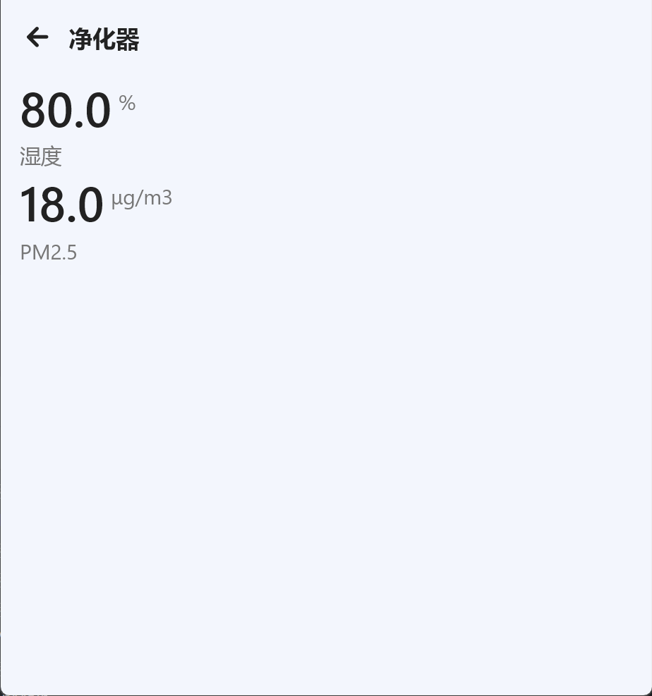
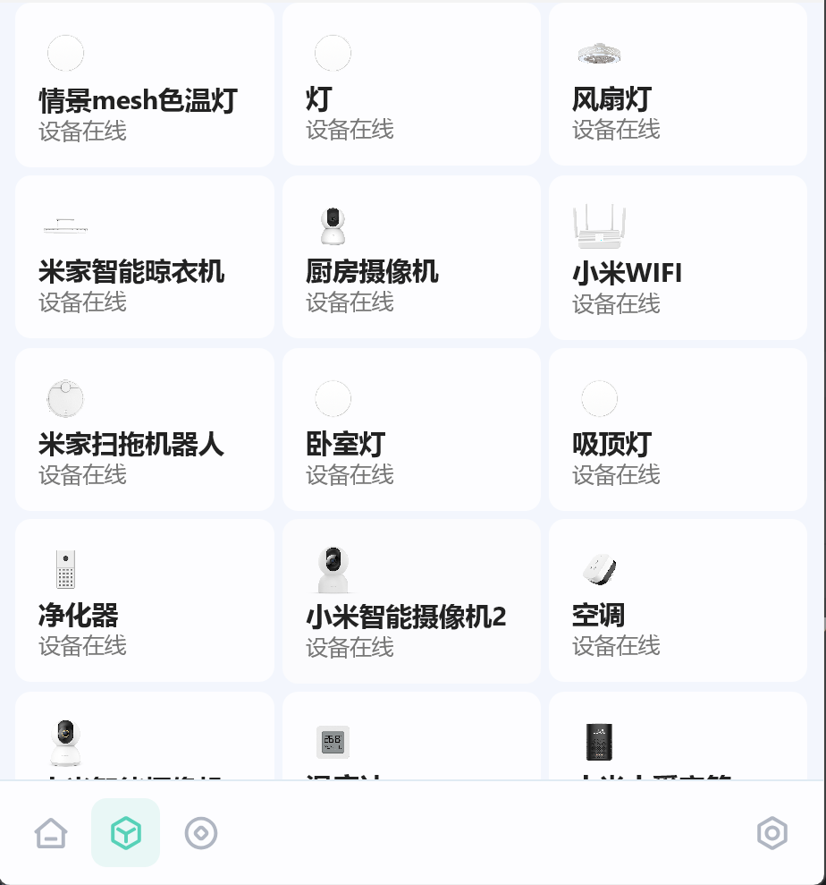

# 米屋 X

第三方电脑端米家

    

## 实机截图

> [!NOTE]
> 运行在 `Windows11`

  

## 目前进度

- [x] 运行起来
- [ ] 优化应用架构
- [ ] 支持更多的 Widget
- [ ] 优化外观
- [ ] 迁移至 KMP

## 米屋开发交流群

QQ: 734254590

## 依赖项目 [sky130/MiWu](https://github.com/sky130/MiWu)

###  miot-api - 小米IoT设备通信接口层
提供与小米IoT设备交互的完整API解决方案

- **设备操作** - 设备状态读取、参数设置、动作执行
- **规格查询** - 设备规格定义获取，支持多语言本地化
- **用户认证** - 支持二维码扫码登录和账号密码登录

###  miwu-support - Widget开发框架
为开发者提供高层抽象的设备控制组件开发框架

- **设备管理** - MiotDeviceManager自动处理设备初始化和状态轮询
- **开发简化** - 注解驱动开发，自动通信处理，专注业务逻辑
- **类型安全** - 泛型支持和生命周期管理，确保代码健壮性

## 致米家公司

一. 本开源项目仅供个人学习交流使用, 方便 Android 手表端可以控制米家的智能家居.

二. 本项目完全免费, 可能存在较多漏洞, 维护者仅保证自己能正常使用, 存在问题请通过项目页 Issues 反馈.

三. 本项目中所有适配的接口均来自小米公司 (北京小米科技有限责任公司) 旗下米家 (MIJIA), 本项目不对其控制的安全性负责.

四. 本项目会将账户、密码、家庭等信息, 缓存在安装设备本地, 不含任何上传个人信息的接口.

五. 真诚希望小米官方能够推出 `米家 For PC`, 使广大消费者能用上.

六. 本项目仅供个人学习交流使用, 切勿进行传播、任何形式的盈利, 未涉及的问题请参见国家有关法律法规, 以国家法律法规为准.

> [!NOTE]
> 如果米家公司需要该项目下架请直接发邮件到**sky233ml@qq.com**
>
> ~~别让我给钱就成，我是学生~~

